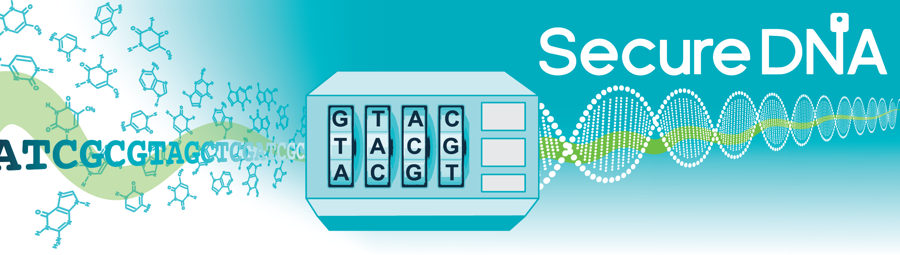

# Secure DNA Project - DNA Synthesis Screening

[&#20013;&#25991;](main-zh.html)
[English](main-en.html)
 

### Navigation
- [Secure DNA Project](main-en.html#the-secure-dna-project)
- Project
  * [Description](main-en.html#the-secure-dna-project)
  * [Proposed Approach](main-en.html#the-proposed-approach)
- Key Features
  * [Unobstructed Research](main-en.html#unobstructed-research)
  * [Information Security](main-en.html#information-security)
  * [Future-Proofing](main-en.html#guarding-against-future-advances)
- [Team](team-en.html#team)
- Challenges
  * [Enabling Legitimate Research](challenges-en.html#challenge-enabling-legitimate-research)
  * [State-Level Actors](challenges-en.html#challenge-state-level-actors)
  * [Database Scrambling](challenges-en.html#challenge-ensuring-attacks-learn-nothing-useful)
  * [Database Size](challenges-en.html#challenge-estimating-required-database-size)
  * [Base Permutations](challenges-en.html#challenge-permutations)
  * [Interrogation](challenges-en.html#challenge-interrogation)
  * [DDoS](challenges-en.html#challenge-ddos-attacks-and-synthesizer-types)
  * [DNA Data Storage](challenges-en.html#challenge-dna-for-information-storage)
- [Manuscripts](manuscripts-en.html#manuscripts)
  

### TODO:
- [ ] make the first line (is italic) under headline blockquote for highlighting?
- [ ] Unobstructed Research growth picture, make it small again (CSS) and align-right?
- [ ] showcase remove in challenges as highlight example
