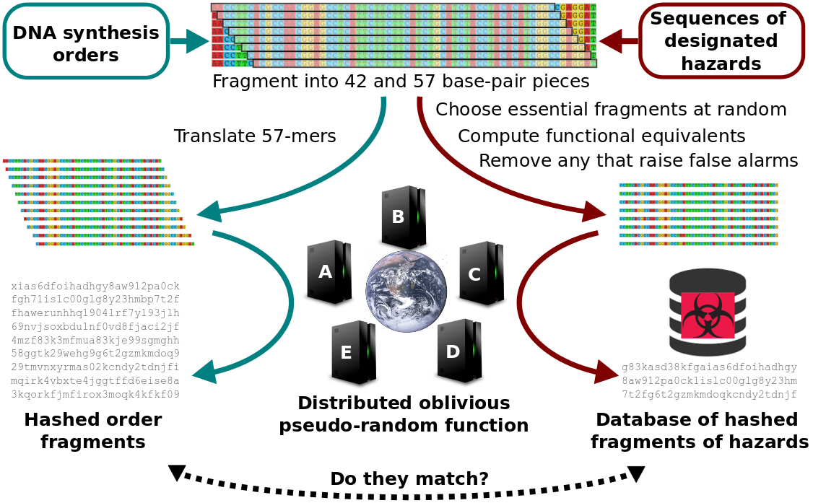
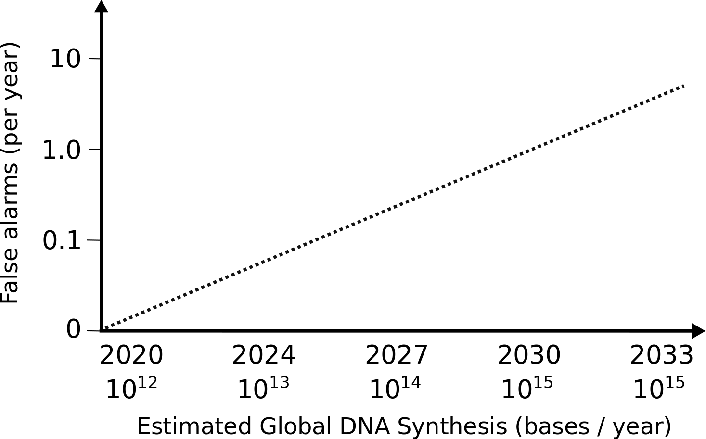

Our team of academic life scientists, cryptographers, and policy analysts from many nations came together in 2019 to devise a system capable of secure and universal DNA synthesis screening that would be suitable for stepwise or complete implementation by stakeholders.

Secure DNA is an automated DNA screening system that will be available everywhere, for free, thanks to philanthropic support. Automation provides key advantages over other screening methods.

Current screening approaches work by looking for similarities between ordered DNA sequences and the genomes of hazardous agents. Unfortunately, there are so many similar sequences that innocent orders are mistakenly identified as threats, requiring human experts to examine them one by one. The cost has deterred some providers from participating, and human-based screening will not be possible for next-generation desktop synthesizers. Worse, the database of hazards is necessarily public, so newly emerging threats can't be blocked without providing potential adversaries with blueprints.

We believe a stronger DNA synthesis screening system can be built from the following tenets:

**Necessity**: we only need to block the synthesis of a few essential pieces of each hazard
**Functionality**: we should also block access to any sequences predicted to function equivalently
**Security**: automated screening should not disclose DNA orders or potential hazards that are not yet public
  

## The Proposed Approach
---
*Securely screen for random critical fragments and functional equivalents without false alarms*

Proposed secure and universal DNA synthesis screening system

DNA synthesis orders are automatically broken into fragments and directly compared to a database of *pieces chosen at random from critical regions* of hazardous sequences. Any ‘adversaries’ attempting to evade screening cannot know which fragments are protected, forcing them to include mutations across the entire sequence of the potential hazard. 

Even mutated fragments can be reliably detected by using the best available computational tools to generate a ranked-order list of all variations predicted to remain functional. A random number of these predicted fragments are included in the database, *but only after removing any that match legitimate sequences in the GenBank repository*, thereby avoiding false alarms. Including variants at random ensures that adversaries cannot know how many mutations are needed to evade detection or where to concentrate them. The only way to evade screening is to include so many mutations that the sequence would be highly unlikely to retain function.

Since the database does not contain matches to unrelated sequences in GenBank that would create false alarms, screening is *accurate enough to be fully automated*, greatly reducing costs.

Finally, the system can be securely implemented by a distributed network of servers to protect the privacy of both the orders and the database contents. *Even hacking multiple servers would uncover nothing*. The fully secure version, which is vital to protect against emerging hazards enabled by future advances without disclosing what is considered dangerous, could be implemented directly or in a stepwise manner depending on the needs of stakeholders.
  

## Unobstructed Research
---

Global DNA synthesis is expected to rise to 1015 base pairs per year in 2030.

*Securing DNA synthesis should not impede legitimate scientific or commercial research.* Because no fragments in the database will match any harmless sequences in the GenBank repository, only random chance could cause an innocent order to be incorrectly identified as hazardous and blocked. We can calculate this probability using the anticipated database size and amount of DNA likely to be synthesized in a given year. Based on projections, *we expect to see approximately one such false alarm in the year 2030.*

Companies or laboratories authorized to work with a blocked agent or sequence can be issued certificates by institutions or governments, which would be sent with orders to major DNA synthesis providers possessing secured machines. Any order fragments that match those listed on the certificate would be automatically approved, *enabling legitimate researchers to receive shipments without delay*. The whitelist mechanism would also prevent abuse of the screening system for individual or commercial gain.
  

## Information Security
---
*Screening should never disclose the identities of DNA synthesis orders or designated hazards.* Current screening practices cannot accomplish either: even if an order is securely transmitted to the synthesis provider, it must be accessible to human experts if flagged as a threat.

Cooperative networks of servers can perform [distributed computations](https://en.wikipedia.org/wiki/Secure_multi-party_computation) without any single machine having access to the relevant data. A [secure distributed one-way transformation](https://en.wikipedia.org/wiki/Pseudorandom_function_family#Oblivious_pseudorandom_functions) can render fragments from orders and hazards uninterpretable, yet still allow them to be compared to determine whether the originals were identical. The database could be made resistant to future quantum computer attacks by arranging for each server to apply an additional [quantum-resistant](https://en.wikipedia.org/wiki/Post-quantum_cryptography) transformation with a unique key and then combining the results.

Our team strongly recommends open-sourcing the code and offering numerous prizes for identified exploits before entrusting the system with sensitive data. 
  

## Commercial Providers and Desktop Machines
---
Screening can be performed by physically secure networks of servers located in each major geographic area. Large companies, including commercial vendors who sell synthetic DNA and assembled genes, will be able to communicate with their local network by private fiber lines for extra security and reliability. 

Next-generation desktop synthesizers, which are anticipated to become available in the next few years, can communicate with servers via the open internet. Working closely with manufacturers can ensure that these machines incorporate hardware locks that will only allow them to function if they receive the correct responses to queries. If screening can be incorporated into all next-generation enzymatic DNA synthesizers and assemblers, the eventual scarcity of chemicals required for older machines will ensure that screening becomes nearly universal.
  

## Guarding Against Future Advances
---
If a minimum number of authorized experts concur that a newly discovered sequence or one that previously appeared innocuous is likely hazardous, they can add essential fragments from that sequence to the hazards database without informing others. 

This feature will allow well-meaning researchers who identify a new potential hazard to prevent misuse without drawing attention to the possibility.
  

## Summary
---
Our proposed approach:
- Permits fully automated screening, requiring no human experts to examine matches
- Can provide maximal security against information hazards and industrial espionage
- Compatible with both large DNA synthesis providers and desktop synthesizers
- Enables legitimate research to proceed unobstructed without any unlocked synthesizers
- Can screen DNA fragments of 42+ base pairs; which is too small to easily assemble
- Can screen design software and DNA sequencing results without information hazards

As a team, we are committed to helping protect the world from current and future autonomous biological hazards. The COVID-19 pandemic has underscored the gravity of this challenge. We pledge to work with DNA synthesis experts, biotechnologists, and policymakers from all nations to help secure our shared world.
  

The Secure DNA Project is expected to evolve through several stages of stepwise adoption.
