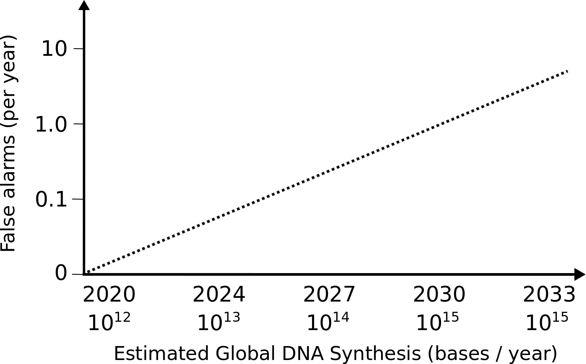
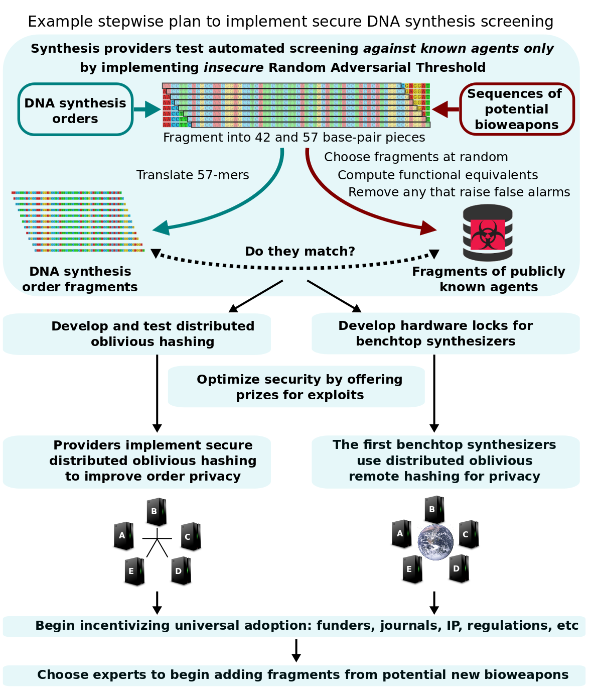

---
layout: default
title: DNA安保项目 - DNA Synthesis Screening
--- 


 

# 捍卫全球生物技术安全

携手共创自主性生物武器零威胁未来

生物工程的革命离不开DNA读写技术的飞跃。生物体构建方面的突破使得人类的生活日趋健康、人性、环保。然而，对相关领域高精尖技术的滥用进行有效防范仍是一大挑战。与曾经夺走亿万生命的各类瘟疫流行病相比，人造病原体杀伤力可能更为巨大。

与核武器所不同的是，目前全球至少有数千人拥有制造与传播自主性生物武器的能力，但前提有二：制造者明确其目标成品，且能够通过组装合成DNA等手段获取实体样本。

因此，为保证人类不受此类生物武器威胁，应当在不透露具体目的的情况下对所有合成DNA进行筛查。确保这样一套全球性筛查系统的安全应满足以下两点：

- 最大程度限制能够获取生物武器的人员数量
- 在最低调条件下有效防范新兴潜在生物武器
  

## DNA安保项目

2019年，来自多个国家的生命科学家、密码学家与政策专家开始联手致力于对全球首个合成DNA全面筛查系统的开发，旨在协助各利益相关方对该系统进行分步性或一次性施行。

目前通用的筛查手段主要在订制的DNA序列与潜在生物武器基因组之间寻找相似度，故在准确性、安全性方面均欠缺。许多相似度高的无害序列被误判为威胁进而需要一一手检。而更大的弊端则在于潜在生物武器数据库的公开性，在防御新兴威胁的同时也将各类威胁的蓝本透露给了不法分子使其得以借此戕害、要挟大众。

综上，本团队以如下三个原则为指导方针，对合成DNA筛查进行全新的探索：

**必要性：**只需阻止每项生物武器中个别关键部分的合成

**功能性：**亦需防止外界获取任何预期功能对等的序列

**安全性：**自动化筛查不得泄露任何DNA订单或潜在生物武器
  

## 拟定方案

*无虚警随机性安全筛查高危片段及其功能对等体*

<!-- Proposed secure and universal DNA synthesis screening system-->

系统自动将合成DNA订单碎片化并与数据库中生物武器关键性区域内随机提取的片段相比较。不法分子（即下文“对手”）在不了解具体受管制片段的情况下只能依靠添加其生物武器完整序列的全部变异来规避筛查。即便如此，仍可通过先进的计算手法生成并排序所有预期功能对等的变体继而轻松检测到变异片段。其后，将所有此类片段与基因银行（GenBank）中合法序列进行匹配并相应剔除以预防虚警，再将余下片段随机抽出部分录入数据库。随机录入确保对手无法准确估算规避筛查所需变异的数量，故只能进行高估。

这一“随机对抗阈值”搜索法使得合成受管制生物武器难上加难。为获取所有所需DNA片段，对手只能依靠大量添加变异致使其武器本身全序列失效。因此，DNA筛查有效杜绝了组装受管制生物武器的任一有效版本。值得一提的是，此筛查法准确度高，可进行全自动化，大幅度节约了成本。

最后，为保证订单及数据库内容的私密性，筛查需由分布式服务器网络安全执行。这样，对手即便攻击多台服务器也无法窃密。届时视各利益相关方需求，可对这一最高安全系数的合成DNA筛查系统进行一次性或分步性施行。
  

## 科研无阻

对合成DNA的筛查不应妨碍正当学术或商业性科研。数据库中片段不可能与基因银行（GenBank）中无害序列相匹配，故正当序列被误判而遭管制的概率仅为偶发。此概率可通过数据库尺寸及每年可能合成DNA总量进行估算。据此预计，2030年虚警数仅约为一例。

科研院所或政府部门可向有权使用受管制病原体或序列的企业或实验室颁发执照，用以同DNA订单一并送至具备安全设备的合成供应商。任何与执照列表内匹配的订单片段将予以自动通过，以便及时将成品送达正规研究人员。此白名单机制亦可有效防范出于私人或商业目的对筛查系统的滥用。
  

## 信息安全

筛查过程不应透露合成DNA订单或潜在生物武器的任何信息，这也是目前通用筛查手段的重大缺陷：订单即便安全传送至合成供应方，一旦被标识为威胁则仍需专家人工介入。

与此相比，合作性服务器网络可在防止任一单机获取相关数据的情况下进行分布式计算。安全、分布式单向变换可在破坏订单片段与生物武器片段解读性的同时对两片段原件之间相同性进行比对。通过让各服务器利用唯一键增加一道抗量子变换后再对结果进行合并，数据库将能够抵御未来可能发生的量子计算机攻击。

本团队强烈推荐对代码进行开源，并在敏感数据投放系统之前通过各类奖励办法集思广益以最大限度发掘并应对各种可能的攻击。
  

## 桌上型合成仪

筛查可通过各主要地区内任何安全安置的服务器网络进行。销售合成DNA及组装基因的各大商业公司可通过私有光纤与其本地网络进行安全、稳定的沟通。而预计将在未来几年内面世的下一代桌上型合成仪则将通过互联网与服务器沟通。因此，当下需与新型合成仪制造商密切配合以确保合成仪配备仅在查询结果正确情况下方准许其运行的硬件锁。如能将筛查系统嵌入下一代酶合成仪及组装仪，则随着老一代化学合成仪所需试剂的淘汰，全面筛查将基本成为现实。
  

## 远期挑战

如少数具备权限的专家在某一新兴威胁上达成共识，则可笔头将系统更新进行书面加密并将实体文件安全送至各服务器网络，以达到向数据库内添加片段的目的。出于对间谍活动的考虑，筛查系统原则上可允许少数甚至单个具备权限的专家在不通告的情况下对系统进行更新。此办法在未来将特别适用于防范杀伤力难以遏制的生物武器。

这样一套为公众所熟知的筛查网络的存在为诸多良心人士提供了至关重要的渠道，以便其在发现新兴潜在生物武器时能够在零泄密的情况下保护大众不受危害，从而避免将武器细节透露给有意且有条件依此制造”死手系统“以要挟国际社会的恶意团体或个人。
  

## 施行程序

单从安全角度出发，筛查系统如能一步到位诚然最为理想。鉴于目前各类所谓无公害制剂的武器化潜力巨大，安全筛查时不我待。然而，全面、安全实施此系统在短期内未必可行。

DNA安保项目团队期待与各方密切合作从而寻找全面实施的最佳途径。例如，分步性实施办法可从当前各DNA供应方开始，通过启用”随机对抗阈值“搜索功能对已知生物武器进行筛查，同时暂缓采取最高安全级别中用于防范商业间谍活动的额外密码技术保护。此办法可为系统的安全实施获取更多研发和测试时间，以确保其最终有助于隐私性及安全性的提升。

 

## 政策考量

鉴于当前发起国之间关系较为紧张，本DNA安保项目在与各相关机构及合成行业保持互通的同时暂且避免政府职工及政府资金的直接介入。本项目虽然由生物工程及密码学方面的领军强国发起，但具体施行还需依靠全世界各国相关人士的多方努力与合作。

世界经济论坛与核威胁倡议协会成立的工作组亦对合成DNA筛查问题进行了独立的研究，并在其报告中呼吁由某全球性、多方参与的技术性联盟研发新一代合成DNA筛查系统。DNA安保项目符合且超越了该工作组提出的包括未来愿景在内的各项目标，如：

- 筛查实现全自动化，无需对匹配结果进行任何手检
- 最大程度防范信息危害和商业间谍活动
- 对大型合成供应商及桌上型合成仪均适用
- 在锁紧每台合成仪的同时确保正当合法科研实行无阻
- 可筛查任何含42个以上碱基对的DNA片段，包括难以组装的超小片段
- 可筛查设计软件及DNA测序结果且绝无信息危害

目前，本团队计划独立完成DNA安保项目的研发，但不排除在未来与该技术性联盟进行合作。

本团队致力于全球范围内生物武器的防控。一旦研发成果无法顺应技术发展，本团队将积极与任何其它相关组织与个人开展合作，以实现一次性或分步性施行安全合成DNA全面筛查的目标。团队各成员唯秉持对此愿景之热忱而绝非受商业利益驱动。

还忆当年，区区若干国家领袖手持大规模杀伤性武器已然将人类文明几度推至浩劫边缘。时至今日，防止千万人获取制造自主性生物武器所需知识与部件应为当务之急。本团队誓与各方为此目标共同努力。

[1918 influenza sick ward, Camp Funston, Kansas, United States](https://commons.wikimedia.org/wiki/Category:Spanish_flu#/media/File:Spanish_flu_hospital.png)
