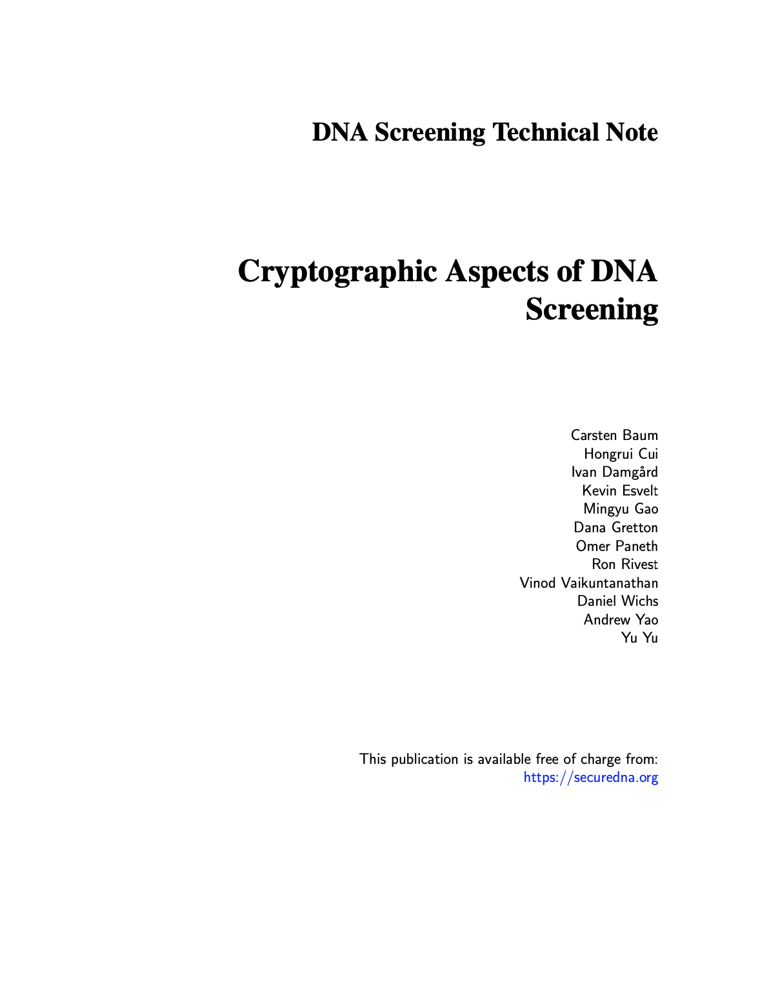
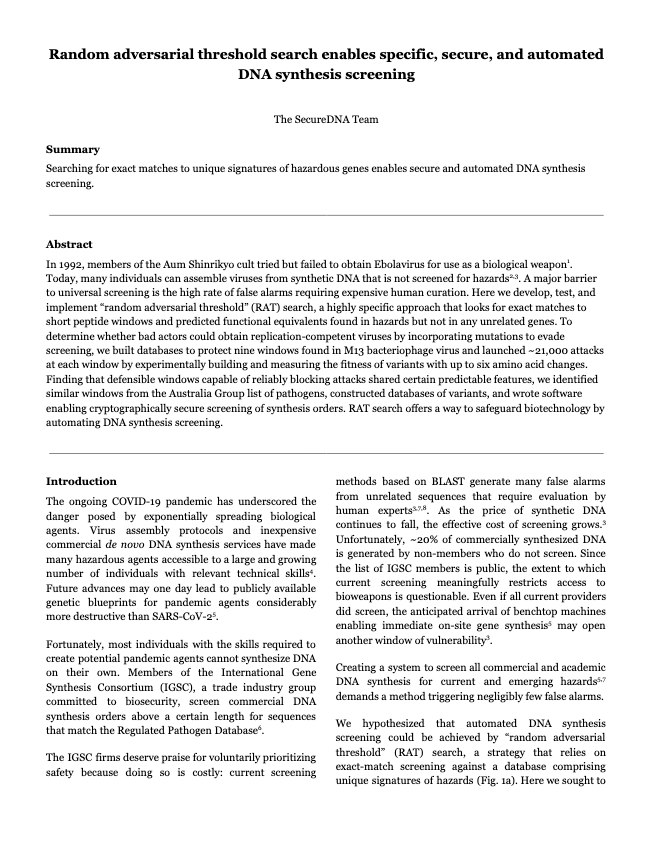

---
layout: default
title: SecureDNA
--- 


 

## Manuscripts

**[Cryptographic Aspects of DNA Screening](https://www.securedna.org/manuscript/Cryptographic_Aspects_of_DNA_Screening).** *Preprint.*

**Carsten Baum1, Hongrui Cui2, Ivan Damgård1, Kevin Esvelt3, Mingyu Gao4, Dana Gretton3, Omer Paneth3,5, Ron Rivest3, Vinod Vaikuntanathan3, Daniel Wichs3,5, Andrew Yao4, Yu Yu2,4**

1Aarhus University

2Shanghai Jiao Tong University

3Massachusetts Institute of Technology

4Tsinghua University

5Northeastern University

### [Cryptographic Aspects of DNA Screening](https://www.securedna.org/manuscript/Cryptographic_Aspects_of_DNA_Screening)

**Abstract**

Securely screening synthetic DNA orders is crucial to minimizing the number of individuals and groups capable of accessing biological weapons of mass destruction, but it must be accomplished without disclosing information on potential bioweapons. Accomplishing this goal requires: 1) screening orders against a database of hazardous sequences, whose secrecy should be protected at the highest possible level while preserving usability; 2) protecting the privacy of the client synthesizer's queries. In this document, we propose a cryptographic screening protocol that accomplishes these objectives, providing accurate complexity-theoretical assumptions, precise security guarantees, and rigorous mathematical proofs. In addition to technical details, we also explain the reasoning behind our protocol design for the benefit of non-cryptographers.

 

**[Random adversarial threshold search enables specific, secure, and automated DNA synthesis screening](https://www.securedna.org/manuscript/Random_Adversarial_Threshold_Screening).** *Preprint.*

**Dana Gretton1, Erika A. DeBenedictis1, Andrew B. Liu2, Andrew C. Yao3,\*, Kevin M. Esvelt1,\***

1Massachusetts Institute of Technology

2Harvard Medical School

3Tsinghua University

\*Corresponding authors

 

### [Random adversarial threshold search enables specific, secure, and automated DNA synthesis screening](https://www.securedna.org/manuscript/Random_Adversarial_Threshold_Screening)

**Summary**

Searching for exact matches to unique signatures of hazardous genes enables secure and automated DNA synthesis screening.

**Abstract**

In 1992, members of the Aum Shinrikyo cult tried but failed to obtain Ebolavirus for use as a biological weapon. Today, many individuals can assemble viruses from synthetic DNA that is not screened for hazards. A major barrier to universal screening is the high rate of false alarms requiring expensive human curation. Here we develop, test, and implement “random adversarial threshold” (RAT) search, a highly specific approach that looks for exact matches to short peptide windows and predicted functional equivalents found in hazards but not in any unrelated genes. To determine whether bad actors could obtain replication-competent viruses by incorporating mutations to evade screening, we built databases to protect nine windows found in M13 bacteriophage virus and launched ~21,000 attacks at each window by experimentally building and measuring the fitness of variants with up to six amino acid changes. Finding that defensible windows capable of reliably blocking attacks shared certain predictable features, we identified similar windows from the Australia Group list of pathogens, constructed databases of variants, and wrote software enabling cryptographically secure screening of synthesis orders. RAT search offers a way to safeguard biotechnology by automating DNA synthesis screening.
